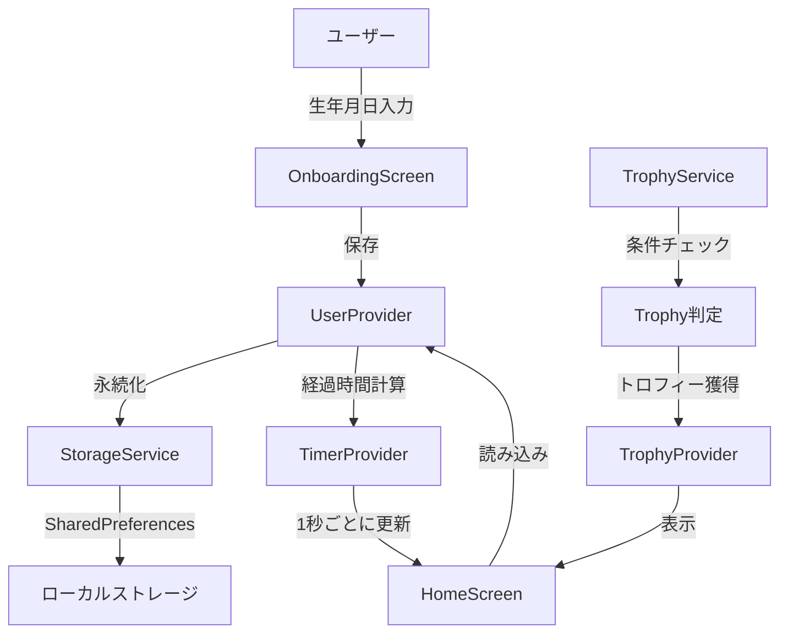
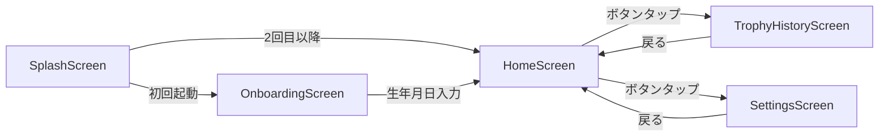

# 📱 Aliby - 生存日数カウントアプリ

生まれてからの経過時間をリアルタイムで表示し、節目をゆるく祝うFlutterアプリケーション

## 🎯 概要

Alibyは、あなたが生まれてから今までの時間を「日」「時間」「分」「秒」単位でリアルタイム表示し、100日ごとやゾロ目などの特別な日をトロフィーでお祝いするアプリです。

## 🏗 アーキテクチャ

### レイヤー構造

```
┌─────────────────────────────────────────────────┐
│                  UI Layer                       │
│         (Screens / Widgets)                     │
├─────────────────────────────────────────────────┤
│              State Layer                        │
│              (Providers)                        │
├─────────────────────────────────────────────────┤
│             Service Layer                       │
│      (StorageService / TrophyService)          │
├─────────────────────────────────────────────────┤
│              Model Layer                        │
│         (UserData / Trophy)                     │
└─────────────────────────────────────────────────┘
```

### データフロー



## 📁 ディレクトリ構造

```
aliby/
├── lib/
│   ├── main.dart                 # アプリのエントリーポイント
│   ├── models/                   # データモデル
│   │   ├── user_data.dart       # ユーザー情報（生年月日）
│   │   └── trophy.dart          # トロフィー情報
│   ├── providers/                # 状態管理（Provider）
│   │   ├── user_provider.dart   # ユーザー情報の状態管理
│   │   ├── timer_provider.dart  # タイマーの状態管理
│   │   └── trophy_provider.dart # トロフィーの状態管理
│   ├── screens/                  # 画面
│   │   ├── home_screen.dart     # メイン画面
│   │   ├── trophy_history_screen.dart # トロフィー履歴
│   │   ├── settings_screen.dart # 設定画面
│   │   └── onboarding_screen.dart # 初回起動画面
│   ├── widgets/                  # 再利用可能なUI部品
│   │   ├── time_display.dart    # 時間表示ウィジェット
│   │   ├── trophy_card.dart     # トロフィーカード
│   │   └── theme_selector.dart  # テーマ選択
│   ├── services/                 # ビジネスロジック
│   │   ├── storage_service.dart # データ永続化
│   │   └── trophy_service.dart  # トロフィー判定ロジック
│   └── utils/                    # ユーティリティ
│       ├── date_utils.dart      # 日付計算
│       └── constants.dart       # 定数定義
├── assets/
│   └── trophy_config.json       # トロフィー定義
├── test/                        # テストコード
│   ├── models/
│   │   └── user_data_test.dart
│   └── services/
│       └── storage_service_test.dart
└── pubspec.yaml                 # パッケージ定義
```

## 🛠 技術スタック

| カテゴリ | 技術 | 用途 |
|---------|------|------|
| フレームワーク | Flutter | クロスプラットフォーム開発 |
| 言語 | Dart | プログラミング言語 |
| 状態管理 | Provider | シンプルな状態管理 |
| ローカルDB | SharedPreferences | 軽量データの永続化 |
| テスト | flutter_test | ユニットテスト・ウィジェットテスト |

## 🔄 状態管理の仕組み

### Provider パターン

```dart
// 状態の流れ
UserProvider (生年月日を保持)
    ↓
TimerProvider (1秒ごとに更新)
    ↓
HomeScreen (表示を更新)
```

### 主要なProvider

| Provider | 責務 | 更新頻度 |
|----------|------|----------|
| UserProvider | ユーザー情報（生年月日）の管理 | 初回設定時のみ |
| TimerProvider | 経過時間の計算と更新 | 1秒ごと |
| TrophyProvider | トロフィーの管理と判定 | 条件達成時 |
| SettingsProvider | アプリ設定（テーマ、表示設定） | 設定変更時 |

## 📱 画面遷移



## 🏆 トロフィーシステム

### トロフィーの種類

| 種類 | 条件 | アイコン |
|------|------|----------|
| 節目記念 | 100日、1000日、5000日など | 🎉 |
| 誕生日 | 1歳、5歳、10歳など | 🎂 |
| ゾロ目 | 1111日、2222日など | 1️⃣2️⃣3️⃣ |
| 特別な日 | 10000日など | 💎 |

### トロフィー判定フロー

```
1. TimerProviderが1秒ごとに更新
2. TrophyServiceが現在の経過日数をチェック
3. trophy_config.jsonの条件と照合
4. 新しいトロフィー獲得時：
   - TrophyProviderに追加
   - ローカル通知（将来実装）
   - 画面に表示
```

## 🧪 テスト戦略

### TDD（テスト駆動開発）

和田卓人さんのRED-GREEN-REFACTORサイクルで開発：

1. **RED**: 失敗するテストを先に書く
2. **GREEN**: テストを通す最小限のコードを書く
3. **REFACTOR**: コードをリファクタリング

### テストカバレッジ

| レイヤー | テスト対象 | カバレッジ目標 |
|---------|-----------|---------------|
| Models | データモデルのロジック | 100% |
| Services | ビジネスロジック | 90%以上 |
| Providers | 状態管理ロジック | 80%以上 |
| Widgets | UI表示ロジック | 70%以上 |

## 🚀 開発の始め方

### 環境構築

```bash
# Flutterの確認
flutter doctor

# 依存関係のインストール
flutter pub get

# テストの実行
flutter test

# アプリの起動
flutter run
```

### 必要な環境

- Flutter SDK: 3.24.x以上
- Dart SDK: 3.5.x以上
- Android Studio / Xcode（各プラットフォーム用）

## 📝 開発ガイドライン

### コーディング規約

1. **Dartの命名規則に従う**
   - クラス名: PascalCase
   - 変数・関数名: camelCase
   - ファイル名: snake_case

2. **コメントの書き方**
   - 各クラス・メソッドに説明を追加
   - Flutter初心者向けに丁寧な説明
   - 必要に応じて公式ドキュメントのURLを記載

3. **any型の使用禁止**
   - 型安全性を保つため、適切な型を定義

### Git コミットメッセージ

```
feat: 新機能追加
fix: バグ修正
docs: ドキュメント更新
style: コードスタイルの修正
refactor: リファクタリング
test: テストの追加・修正
```

## 🔮 今後の機能拡張予定

- [ ] トロフィーのアニメーション演出
- [ ] カスタム記念日の登録
- [ ] ウィジェット機能
- [ ] 多言語対応
- [ ] ダークモード自動切り替え
- [ ] データのバックアップ・復元

## 📄 ライセンス

MIT License

## 👥 コントリビューター

- 開発: [あなたの名前]
- 設計支援: Claude (Anthropic)
